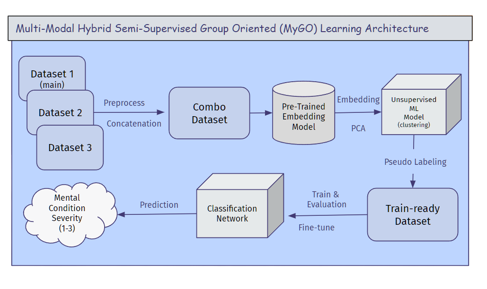

# Cross-Dataset-Tabular-Embedding-Network-on-Mental-Health

## Project Description
This is a project aiming to implement a method of handling multiple datasets with different features (columns) and create numerical embeddings for a mixed type of features targeting mental health condition severity multi-class classification task.

Our project examines data about people's backgrounds, jobs, and personal information to identify potential mental health risks at work. By using multiple machine learning methods, we aim to measure overall mental health risks and identify employees who are at high risk. 

## Getting Started
### Project Structure
In the notebook, in sequence, there are 3 main sections and multiple subsections:
1. Data Loading and Preprocessing
   1. Dataset 1
   2. Dataset 2
   3. Dataset 3
2. Pseudo Label Model
   1. Label Encoder
   2. Tabular Embedding
   3. Import Embedding Data
   4. PCA
   5. KMean Pseudo Labeling
3. Classification Model
   1. Artificial Neural Network (Main model)
   2. Random Forest
   3. CatBoost
   4. Gradient Boosting
   5. Multi-logistic Regression
   6. Support Vector Machine
   7. K-Nearest Neighbors
   8. Decision Tree
   9. XGBoost Classifier
   10. Multi-Layer Perceptron
   11. Naive Bayes Classifier

### How to run
- Enter directory `./notebook/Mental_health_prediction.ipynb` to access the notebook file
- Run the entire `Data Loading and Preprocessing` section to examine data preprocessing
- The `Pseudo Label Model` section has a few subsections, the `Pseudo Label Model/Tabular Embedding` may take a long time to run in CPU runtime
   - May skip to `Pseudo Label Model->Import Embedding Data` to fetch the transformed dataset, which is being preprocessed, encoded, and embedded.
   - Proceed to run `Pseudo Label Model->PCA` and `Pseudo Label Model->KMean Pseudo Labeling` to acquire a pseudo-labeled embedded dataset
- Run `Classification Model -> Artificial Neural Network (Main model)` to inspect model constructing, model training, hyperparameter search, model evaluating, etc.
   - Model **3.ii** to **3.xi** is for early-stage model selection, mainly for demonstration purposes and it's trained and evaluated on **dataset1** only
 
## Model Information
### Architecture

## Credit
Jack Logan [jwl8194@nyu.edu](https://github.com/jwlogan5)

Charles Zhanng [sz3583@nyu.edu](https://github.com/bocchii-the-code)

Hanwen Zhang [hz3177@nyu.edu](https://github.com/hanwenzhang01)

Zihan Zhou [zz4029@nyu.edu](https://github.com/jamesz102)

